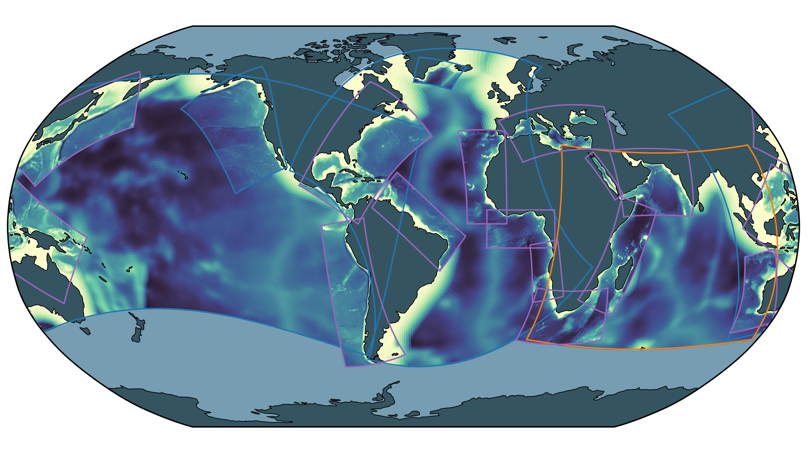
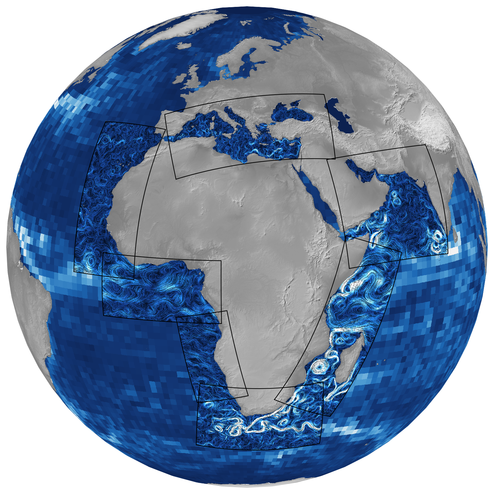

# cson-seascapes

## Global Ocean Numerical Observatory

Visualizations of the C-Star Ocean Network (C-SON) — a global collection of
regional and basin-scale ROMS configurations supported by the
[C-Star](https://github.com/CWorthy-ocean/C-Star) reproducible workflow
framework. Grid geometries live in [`grids.yml`](grids.yml); the notebooks
build each grid with `roms_tools` and render it.

## Network domain map

Each rectangle delineates a ROMS grid configuration on a global Robinson
projection. Perimeter color denotes the validation state of the configuration:

- **blue — Scientifically validated:** the configuration's ocean (and
  biogeochemical, where applicable) solution has been evaluated against
  observations.
- **orange — Functionally validated:** the configuration runs end-to-end
  and produces a stable solution, but has not yet been scientifically
  validated.
- **purple — Illustrative of potential extensions to the network:**
  candidate domains whose geometries are defined here but which are not yet
  configured.

All domains shown are supported by the C-Star reproducible workflow
framework, which enables users to build and operate any of these models on
a supported machine.

## Africa Domains

An aspirational view of the C-SON regional domains around Africa, over a
snapshot of surface ocean kinetic energy (`KE = ½(u² + v²)`) from the
[Mercator GLORYS12V1 reanalysis](https://data.marine.copernicus.eu/product/GLOBAL_MULTIYEAR_PHY_001_030/description).
Surface currents are drawn with a line-integral convolution (LIC) so eddies
and jets appear as flowing streaks.

- **Inside the regional grids** (black outlines): the full 1/12° GLORYS field.
- **Outside:** KE block-averaged onto 20×20 boxes (~1.7°), approximating a
  coarse global model.

`cson_map_ke_africa.ipynb` downloads GLORYS over a configurable date range and
produces both this still and an animation (`cson-map-ke-africa.mp4`) of the
currents evolving day by day. Adjust `MOVIE_START` / `MOVIE_END` / `FPS` at the
top of the notebook to change the clip.

## Files

- [`grids.yml`](grids.yml) — grid configurations (geometry + validation state)
  for every domain in the network. Units and the rotation convention are
  documented in the file header.
- `cson_map.ipynb` → `cson-map.png` — builds every grid via `roms_tools` and
  renders the global domain map.
- `cson_grids_layout.ipynb` → `cson-map-grids.png` — lightweight,
  geometry-only viewer (skips topography for speed) for rapidly iterating on
  grid placement while editing `grids.yml`.
- `cson_map_ke_africa.ipynb` → `cson-map-ke-africa.png` +
  `cson-map-ke-africa.mp4` — the Africa surface-KE still and animation.

## Running

The notebooks target a Python environment with `roms_tools`, `cartopy`,
`cmocean`, `pyyaml`, `matplotlib`, `numpy`, `xarray`, `numba`, `rioxarray`,
and `rasterio`. Open a notebook and run all cells.

The KE notebook additionally needs:

- `copernicusmarine` to fetch GLORYS — a free
  [Copernicus Marine](https://data.marine.copernicus.eu) account is required;
  run `copernicusmarine login` once to store credentials.
- the system `ffmpeg` binary to write the animation.

Static rasters (Natural Earth shaded relief) and topography are downloaded
automatically into the `roms-tools` cache on first run.
